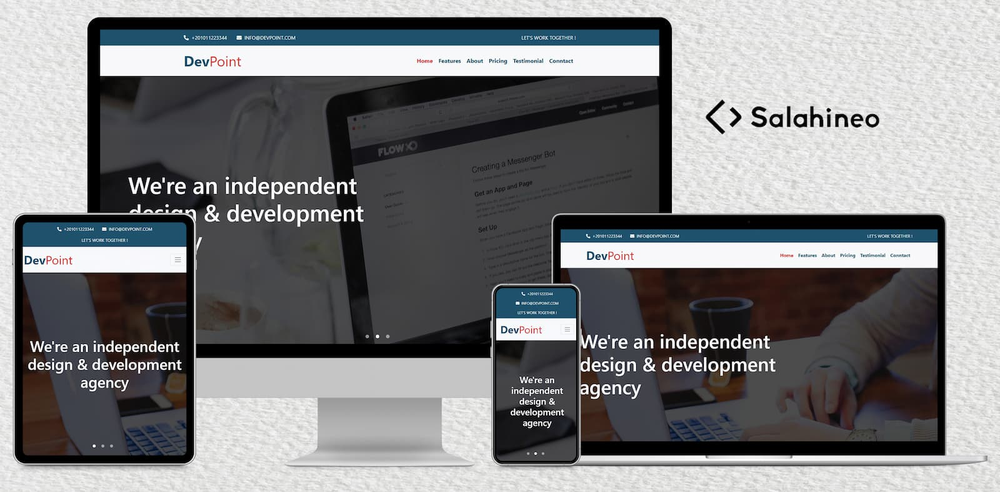

<h1 align="center">DevPoint</h1>

## Table of Contents

- [Goal](#goal)
- [Benefits](#benefits)
- [Demo](#demo)
- [Technologies](#technologies)
- [Contact](#contact)
- [Copyright and license](#copyright-and-license)

### Goal

This project is the 4th challenge to me. I coded this project to practice on my knowledge of HTML, CSS, JavaScript, and Bootstrap in real project.

### Benefits

Here are some ideas to benefit from this project:

- Take this project as a task and try to make it, and if you could not do a specific section, see how i make it in the source code (use comments to reach this section).
- Extract code of specific section and use it in your project.
- Review source code to see how other people code their projects.
- Edit on this project after studying its code well, to know how to work in pair-programming with other people
- Upgrade this project, and add your own sections or pages

### Demo

Here is the demo of this <a href="salahineo.github.io/devpoint/" target="_blank">project</a>

### Technologies

- HTML5
- CSS3
- JavaScript
- Bootstrap4

> This project is fully responsive

### Contact

- <a href="https://github.com/salahineo" target="_blank">Github</a> :octocat:
- <a href="https://github.com/salahineo" target="_blank">LinkedIn</a> 💼
- <a href="https://github.com/salahineo" target="_blank">Website</a> :globe_with_meridians:
- <a href="https://github.com/salahineo" target="_blank">Facebook</a> 😎
- <a href="https://github.com/salahineo" target="_blank">Twitter</a> 🐤
- <a href="mailto:eng.mohamedsalah.it@gmail.com">Email</a> :email:

### Copyright and license

- **<a href="https://www.gnu.org/licenses/gpl-3.0" target="_blank">GPLv3</a>**
- **© 2020 | Mohamed Salah**

---

**If You Find My Work Good, Consider Giving it a :star: or Fork-ing to Show Some :heart:. It Helps Me Stay on Track and Be Motivated.**

> **Explore all of my projects from [Here](https://github.com/salahineo/Projects-Reference)**

---
